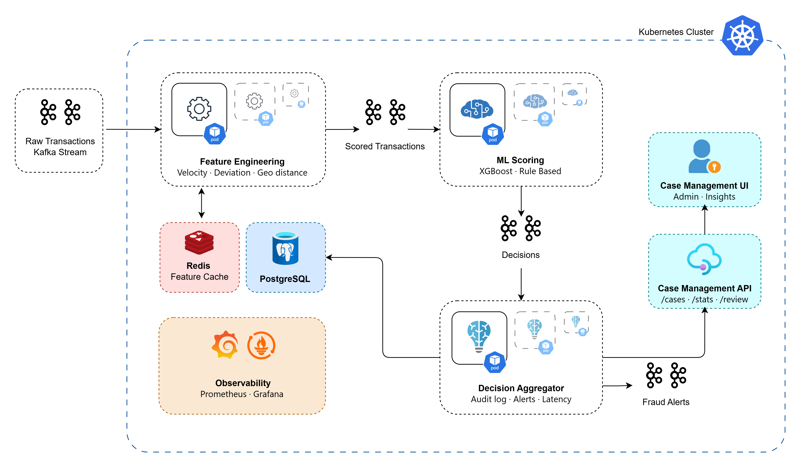
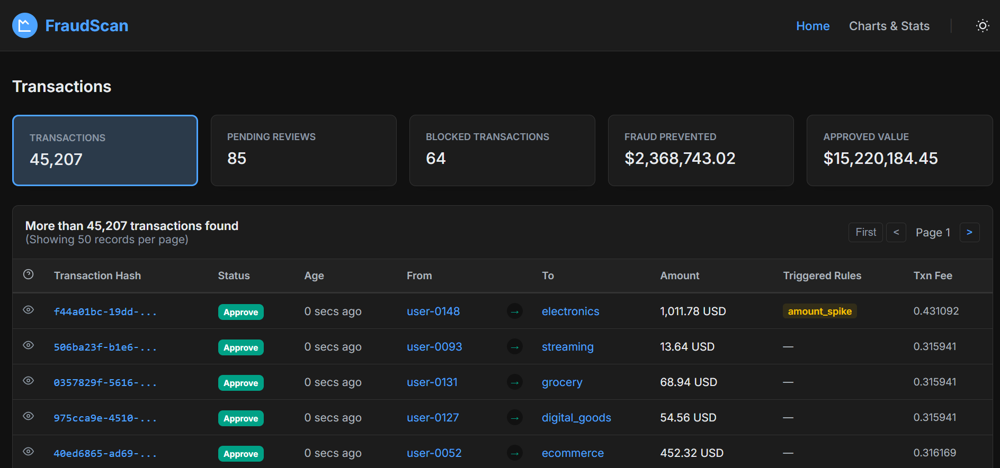
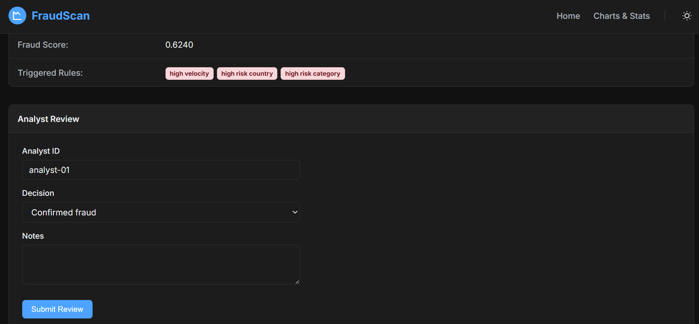
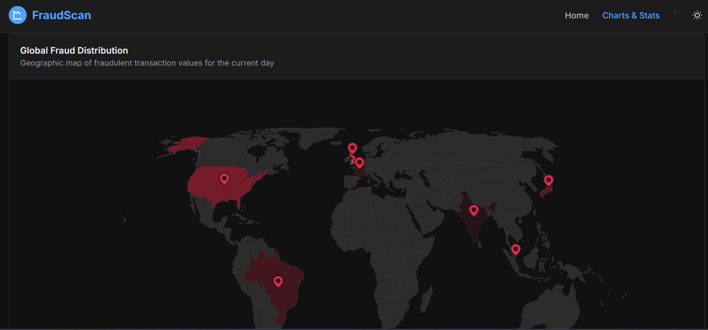
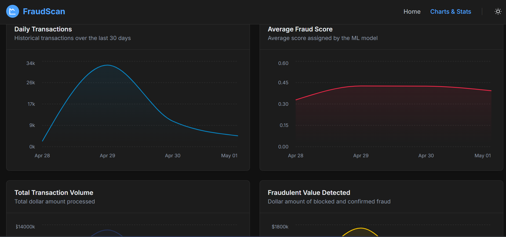

# Real-Time Financial Fraud Detection System (FraudScan)

A production-grade, cloud-native fraud detection platform built on Kubernetes, Apache Kafka, and XGBoost. The system processes financial transactions in real time, scores each one for fraud using a machine learning model combined with a rules engine, and surfaces decisions to analysts through a live case management dashboard.

> **Running the system?** See [STEPS.md](./STEPS.md) for the full startup guide — from a clean environment to a live dashboard.

---

## What this system does

Every transaction that enters the system travels through a multi-stage pipeline. The simulator generates realistic financial events at configurable throughput. Each event flows through feature engineering, where rolling-window user behaviour features are computed and cached. The enriched event is then scored by an XGBoost model trained on synthetic fraud patterns, combined with a deterministic rules engine that catches known fraud signatures. The final decision: approve, review, or block is written to an audit log and surfaced on a live analyst dashboard.

The architecture is designed so that every stage scales independently. When transaction volume increases, KEDA (Kubernetes Event Driven Autoscaler) detects the rising Kafka consumer lag and spawns additional pods automatically. When volume drops, pods terminate. No manual intervention is required.

---

## Architecture



```
Transaction Simulator
        │
        ▼  Kafka: transactions-raw
Feature Engineering  ◄──► Redis (user feature cache)
        │
        ▼  Kafka: transactions-scored
ML Scoring  (XGBoost + Rules Engine)
        │
        ▼  Kafka: fraud-decisions
Decision Aggregator  ──► PostgreSQL (audit log)
        │
        ▼  Kafka: fraud-alerts
Case Management API
        │
        ▼
Case Management UI  (React, live dashboard)
```

Each arrow is a Kafka topic. Services are decoupled, no service calls another directly. This is what makes horizontal scaling clean and deterministic.

---

## Services

### Transaction Simulator
Generates synthetic financial transactions at a configurable rate (transactions per second). Each transaction includes realistic fields merchant, amount, geography, payment method, device and a configurable percentage are injected with one of six known fraud patterns: card testing, account takeover, impossible travel, high-value spike, money mule, and friendly fraud. Every transaction is tagged with a creation timestamp used to measure end-to-end latency.

### Feature Engineering
Consumes raw transactions from Kafka. For each transaction it computes a set of rolling-window features: transaction velocity for the user in the past 10 minutes, deviation of the current amount from the user's personal average spend, time since their last transaction, geolocation distance from home coordinates, and whether the device is new. These features are written to Redis with a 24-hour TTL and the enriched event is forwarded to the next topic.

### ML Scoring
Consumes enriched feature vectors from Kafka. Each vector is scored by an XGBoost classifier trained on 100,000 synthetic transactions. The ML score is combined with a rule-based score from the rules engine which evaluates velocity thresholds, high-risk countries, impossible travel, amount spikes, and known bad merchants. The two scores are blended (70% ML, 30% rules) into a final fraud probability. Transactions above 0.7 are blocked, between 0.4 and 0.7 are flagged for review, and below 0.4 are approved.

### Decision Aggregator
Consumes final decisions from Kafka and writes them to PostgreSQL with the full audit record ML score, rules score, final score, triggered rules, transaction fields, and end-to-end processing time. Blocked and review-flagged transactions are also published to a fraud-alerts topic and can trigger email or webhook notifications.

### Case Management API
A FastAPI service that exposes the PostgreSQL audit log via REST endpoints. Analysts can list cases filtered by decision, view individual transaction details, and submit review labels (confirmed fraud, false positive, or needs more info). These labels feed back into future model retraining.

### Case Management UI
A React dashboard that polls the case management API and displays live transaction decisions with animated stat cards, score bars, and a decision breakdown. Analysts can click any transaction to open a detail view, inspect all scores and triggered rules, and submit a review. The analytics page shows decision distribution charts and real-time latency metrics.









---

## Machine learning

The model is XGBoost trained offline on synthetic data generated by the same simulator that runs in production. This ensures training and serving distributions are aligned. Features used for training are identical to those computed by the feature engineering service at runtime velocity, amount deviation, geo distance, device novelty, cross-border flag, and high-risk country flag, plus encoded categorical features for merchant category, payment method, and channel.

Class imbalance (2% fraud rate) is handled via `scale_pos_weight`. The model is evaluated on area under the precision-recall curve rather than AUC-ROC, which is more appropriate for imbalanced fraud datasets. The trained model is saved in XGBoost's native binary format and baked into the ml-scoring Docker image at build time — no model server or MLflow runtime is required.

---

## Autoscaling

On both local Minikube and Azure AKS, KEDA monitors Kafka consumer lag for each consumer group. The scaling formula is:

```
desired_replicas = total_lag / lagThreshold (set to 10)
```

Each of the three consumer services feature engineering, ml scoring, and decision aggregator — has its own ScaledObject. They scale independently based on the lag of their respective upstream topic. The minimum is one pod at idle, and the maximum is six pods per service. Pods scale up within 15 seconds of lag building and scale down after a 30-second cooldown once lag clears.

Since each topic has three partitions, up to three pods can process in parallel with perfect partition balance. Beyond three pods, additional instances sit ready for partition reassignment if partitions are increased which is the path for scaling beyond the current ceiling.

---

## Data pipeline

The Kafka topics act as the backbone of the system:

| Topic | Producers | Consumers | Partitions |
|---|---|---|---|
| transactions-raw | Transaction simulator | Feature engineering | 3 |
| transactions-scored | Feature engineering | ML scoring | 3 |
| fraud-decisions | ML scoring | Decision aggregator | 3 |
| fraud-alerts | Decision aggregator | Downstream alerting | 3 |

All topics use gzip compression and `acks=all` for durability. Consumer groups ensure each message is processed exactly once per service even when multiple pods are running.

---

## Deployment environments

### Local (Minikube)
Kafka runs via the Strimzi operator. PostgreSQL and Redis are deployed via Bitnami Helm charts. All Docker images are built locally and loaded into Minikube's Docker daemon. KEDA is installed via Helm. The UI is accessible via `kubectl port-forward`.

### Azure (AKS)
Kafka is replaced by Azure Event Hubs, which exposes a Kafka-compatible API — no producer or consumer code changes are needed, only the bootstrap server and SASL credentials differ. PostgreSQL becomes Azure Database for PostgreSQL Flexible Server. Redis becomes Azure Cache for Redis. Docker images are pushed to Azure Container Registry and pulled by AKS. KEDA runs on AKS and reads consumer lag from Event Hubs. The AKS cluster autoscaler handles node-level scaling in addition to KEDA's pod-level scaling.

The only files that differ between environments are the Helm values files. All chart templates, all service code, and all Kubernetes manifests are identical.

---

## Technology stack

| Layer | Technology |
|---|---|
| Container orchestration | Kubernetes (Minikube / AKS) |
| Package management | Helm |
| Event streaming | Apache Kafka (Strimzi / Azure Event Hubs) |
| ML framework | XGBoost |
| Feature cache | Redis |
| Audit store | PostgreSQL |
| Autoscaling | KEDA (Kafka lag-based) |
| API framework | FastAPI |
| Frontend | React + Recharts |
| CI/CD | GitHub Actions |
| Container registry | ACR (Azure) / local Docker |
| Infrastructure | Azure (AKS, Event Hubs, PostgreSQL, Redis, ACR) |

---


## Key design decisions

**Kafka as the backbone** - Every service communicates exclusively through Kafka topics. No direct HTTP calls between pipeline stages. This decouples throughput a slow scoring service builds lag rather than blocking the simulator, and KEDA responds by adding pods.

**ML + rules together** - The XGBoost model catches statistical anomalies. The rules engine catches known fraud signatures that may not yet appear in training data. Neither alone is sufficient; the blended score outperforms either in isolation.

**Model baked into image** - The trained model is copied into the ml-scoring Docker image at build time. This eliminates a runtime dependency on MLflow or any model server, simplifies deployment, and makes the scoring service stateless and trivially scalable.

**Environment-agnostic charts** - Helm chart templates contain no environment-specific values. All differences between local and Azure live in `helm/values/`. This makes the Azure migration a configuration change rather than a code change.

**Analyst feedback loop** - The case management UI allows analysts to label decisions as confirmed fraud or false positive. These labels are stored in PostgreSQL and can be used to retrain the model on real-world outcomes rather than only synthetic data.

---

## Fraud patterns modelled

| Pattern | Description |
|---|---|
| Card testing | Tiny amounts (< $2) on digital goods via API to verify stolen card details |
| Account takeover | Large transfer from unknown device with new IP address |
| Impossible travel | Merchant in high-risk country within hours of home-country transaction |
| High-value spike | Single transaction far above the user's historical average |
| Money mule | Round amounts sent repeatedly to high-risk countries |
| Friendly fraud | Legitimate transaction later disputed for chargeback abuse |

---

*For setup instructions, startup commands, troubleshooting, and the full operational guide- see [STEPS.md](./STEPS.md).*